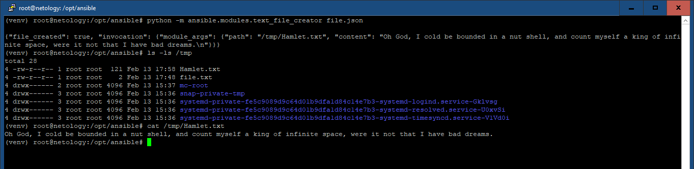
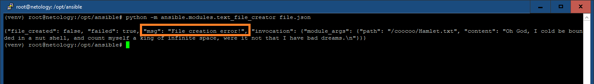
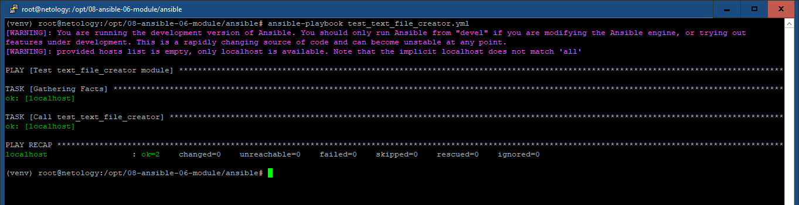
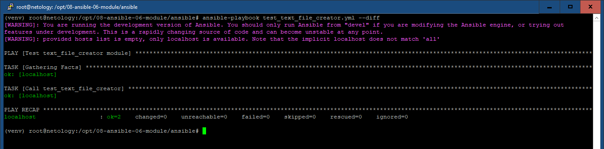

# 08-ansible-06-module

## Основная часть

1,2,3. text_file_creator.py:

``` python
#!/usr/bin/python

from __future__ import (absolute_import, division, print_function)
__metaclass__ = type

DOCUMENTATION = r'''
---
module: text_file_creator
short_description: Модуль создает текстовые файлы
version_added: "1.0.1"
description: Модуль создает текстовые файлы с заданным путем и заданным содержимым
options:
    path:
        description: Полный путь к файлу включая имя и расширение
        required: true
        type: str
    content:
        description: Текстовое содержимое файла
        required: true
        type: str
extends_documentation_fragment:
    - netology.tvm2360.text_file_creator_doc_fragment
author:
    - tvm2360
'''

EXAMPLES = r'''
- name: Test
  netology.tvm2360.text_file_creator:
    path: /tmp/filename.txt
    content: qwerty
'''

RETURN = r'''
{"file_created": true, "invocation": {"module_args": {"path": "/tmp/filename.txt", "content": "qwerty"}}}
'''

from ansible.module_utils.basic import AnsibleModule

def file_create_module():

    module_args = dict(
        path = dict( type = 'str', required = True ),
        content = dict( type = 'str', required = True )
    )
    result = dict(
        file_created=True
    )
    module = AnsibleModule(
        argument_spec=module_args,
        supports_check_mode=True
    )
    if module.check_mode:
        module.exit_json(**result)
    try:
        file_out = open( module.params['path'], "w", encoding="utf-8" )
        file_out.write( module.params['content'] )
        file_out.close
    except:
        result['file_created'] = False
        module.fail_json( msg='File creation error!', **result )
    module.exit_json(**result)

def main():
    file_create_module()

if __name__ == '__main__':
    main()
```

4. Локальная проверка

Создаем file.json:
``` json
{
    "ANSIBLE_MODULE_ARGS": {
        "path": "/tmp/Hamlet.txt",
        "content": "Oh God, I cold be bounded in a nut shell, and count myself a king of infinite space, were it not that I have bad dreams."
    }
}
```

Запускаем:
``` bash
python -m ansible.modules.text_file_creator file.json
```



Теперь намеренно допускаем ошибку для проверки секции try/except (несуществующая папка /coocoo):
``` json
{
    "ANSIBLE_MODULE_ARGS": {
        "path": "/coocoo/Hamlet.txt",
        "content": "Oh God, I cold be bounded in a nut shell, and count myself a king of infinite space, were it not that I have bad dreams."
    }
}
```

Результат:



5. Single task playbook

test_text_file_creator.yml:
``` yml
---
- name: Test text_file_creator module
  hosts: localhost
  tasks:
    - name: Call test_text_file_creator
      text_file_creator:
        path: /tmp/sepultura.txt
        content: Ratamahatta
```
``` bash
ansible-playbook test_text_file_creator.yml
```



Файл:


6. Test

``` bash
ansible-playbook test_text_file_creator.yml --diff
```



